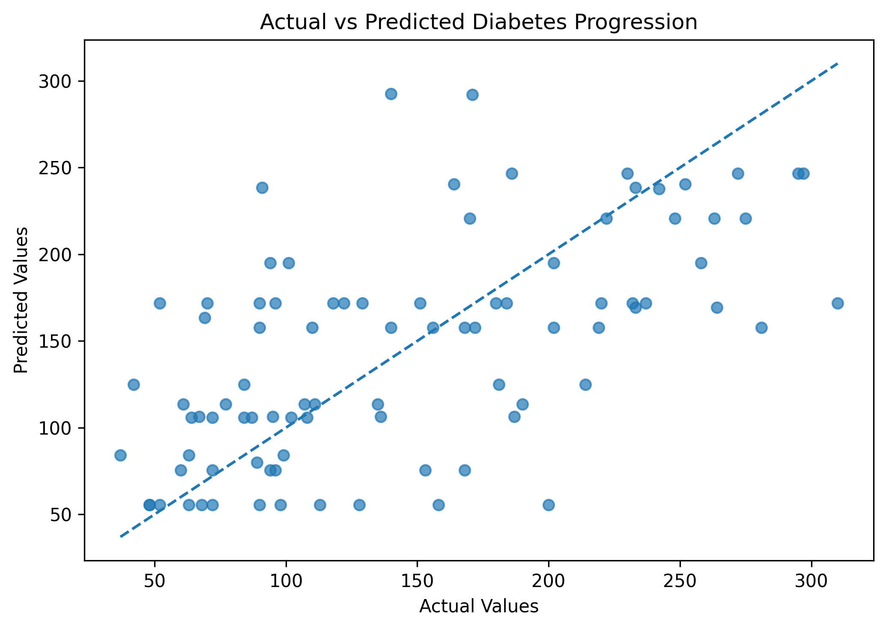

# Decision Tree Regressor from Scratch

A NumPy implementation of a regression decision tree from scratch using mean squared error (MSE) for split selection.

The project implements the core mechanics of a regression tree without using scikit-learn for the actual tree construction. The implementation is then compared with `DecisionTreeRegressor` from scikit-learn using the same dataset and hyperparameters.

## Project Overview

A decision tree regressor recursively splits the training data into smaller groups so that the target values within each group become as similar as possible.

This implementation demonstrates the main steps involved in building a regression tree:

* Representing tree nodes
* Calculating mean squared error
* Evaluating candidate splits
* Selecting the best feature and threshold
* Recursively building the tree
* Predicting with the tree
* Evaluating regression performance
* Comparing the scratch implementation with scikit-learn

## How the Algorithm Works

### 1. Calculate MSE

For a group of target values, the mean squared error is calculated around the group's mean:

$$
MSE = \frac{1}{n}\sum_{i=1}^{n}(y_i-\bar{y})^2
$$

A lower MSE means that the target values are more closely grouped around their mean.

### 2. Find the Best Split

For every feature, the implementation:

1. Sorts the unique feature values.
2. Creates candidate thresholds between consecutive unique values.
3. Splits the samples into left and right groups.
4. Calculates the weighted MSE of the two groups.
5. Selects the feature and threshold with the lowest weighted MSE.

The weighted split MSE is:

$$
MSE_{split} = \frac{n_L}{n}MSE_L + \frac{n_R}{n}MSE_R
$$

where $n_L$ and $n_R$ are the numbers of samples in the left and right groups.

### 3. Build the Tree Recursively

After selecting the best split, the data is divided into two subsets and the same process is applied recursively to each subset.

Tree construction stops when:

* The maximum tree depth is reached.
* Too few samples remain to split the node.
* No valid split can be found.

### 4. Make Predictions

When a sample reaches a leaf node, the prediction is the mean target value of the training samples contained in that leaf.

## Dataset

The project uses the **Diabetes dataset** provided by scikit-learn through `load_diabetes()`.

The dataset contains 442 samples with 10 input features and a quantitative target representing disease progression.

No external dataset file is required because the dataset is included with scikit-learn.

## Model Configuration

The scratch implementation uses:

```text
max_depth = 5
min_samples_split = 3
min_samples_leaf = 1
```

The same settings are used for the scikit-learn `DecisionTreeRegressor` comparison.

The dataset is split into:

```text
Training set: 80%
Test set:     20%
random_state: 42
```

## Results

### Scratch Implementation

| Metric |  Result |
| ------ | ------: |
| MSE    | 3773.66 |
| RMSE   |   61.43 |
| R²     |   0.288 |

### Scikit-learn

| Metric |  Result |
| ------ | ------: |
| MSE    | 3546.01 |
| RMSE   |   59.55 |
| R²     |   0.331 |

The scratch implementation produces somewhat different results from scikit-learn, but the results are reasonably close.

The difference is expected because this implementation is a simplified educational version and does not reproduce every implementation detail and optimization used by scikit-learn.

## Visualization

The project also generates an actual-vs-predicted plot for the scratch model.

The dashed diagonal line represents perfect predictions. Points closer to this line indicate predictions that are closer to the corresponding actual target values.



## Project Structure

```text
decision-tree-regressor-from-scratch/
│
├── .gitignore
├── README.md
├── requirements.txt
│
├── results/
│   └── actual_vs_predicted.png
│
└── src/
    └── decision_tree_regressor.py
```

## How to Run

Clone the repository and install the required packages:

```bash
pip install -r requirements.txt
```

Then run:

```bash
python src/decision_tree_regressor.py
```

The script will:

1. Load the Diabetes dataset.
2. Split the data into training and test sets.
3. Build the regression tree from scratch.
4. Generate predictions.
5. Calculate MSE, RMSE, and R².
6. Save the actual-vs-predicted plot.
7. Train a scikit-learn regression tree.
8. Compare the two implementations.

## Limitations

This implementation is designed for learning and clarity rather than computational efficiency.

* Candidate thresholds are evaluated exhaustively.
* The implementation does not include pruning.
* Only a small set of stopping criteria is implemented.
* Hyperparameters are manually specified.
* The evaluation uses a single train-test split rather than cross-validation.
* The implementation does not include the optimizations used by production machine-learning libraries.

## Technologies

* Python
* NumPy
* Matplotlib
* scikit-learn

## Purpose

This project was created to understand the internal mechanics of decision tree regression by implementing the core algorithm from scratch before comparing it with a standard machine-learning library implementation.
